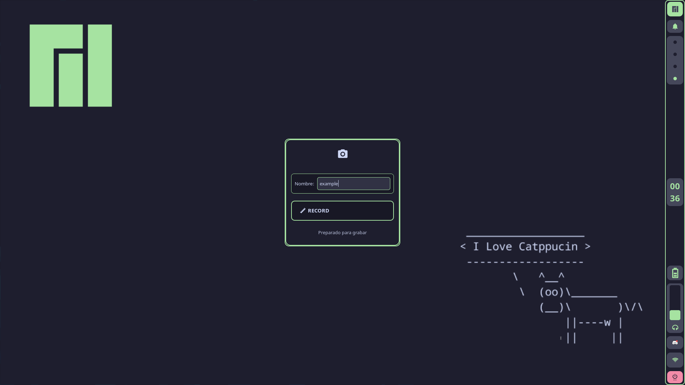
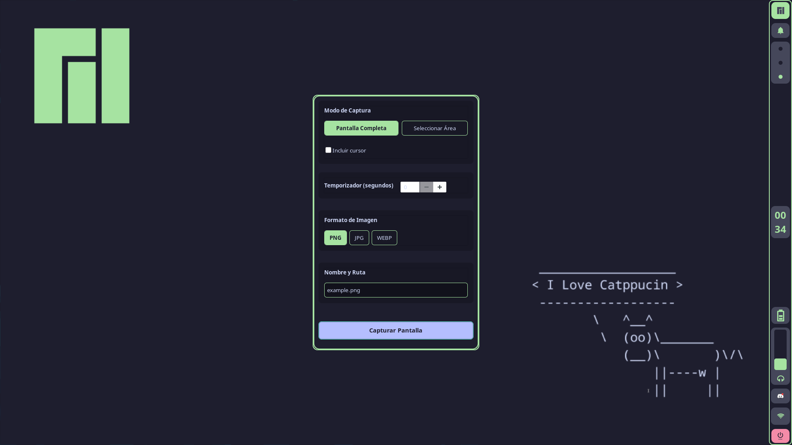
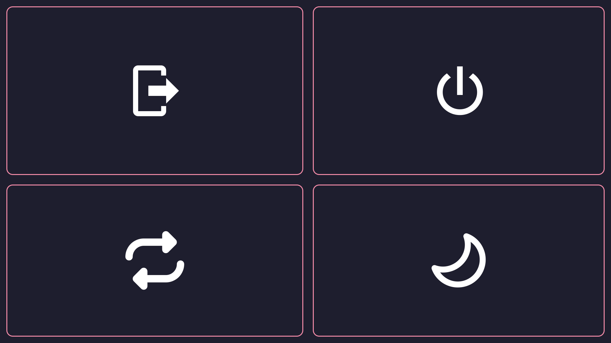

# Some Py Apps
These applications run on CSS within the Python file, making them highly customizable. They were developed in a Hyprland environment, so they offer high compatibility with it. Although they haven't been tested in other environments, I still hope they work in all possible environments.
<details>
<summary>Recordme.py</summary>


### Install
(Arch)
```
sudo pacman -S python-gobject gtk3
git clone https://github.com/Alexxami/SomePyApps.git
cd src/Recordme.py
cp * /usr/share/applications/
```
(Debian/Ubuntu)
```
sudo apt-get install python3-gi python3-gi-cairo gir1.2-gtk-3.0 python3-gi wf-recorder
git clone https://github.com/Alexxami/SomePyApps.git
cd src/Recordme.py
cp * /usr/share/applications/
```
  
</details>

<details>
<summary>Screenme.py</summary>


### Install
(Arch)
```
sudo pacman -S python-gobject gtk3 python3-gi grim slutp
git clone https://github.com/Alexxami/SomePyApps.git
cd src/Screenme.py
cp * /usr/share/applications/
```
(Debian/Ubuntu)
```
sudo apt-get install python3-gi python3-gi-cairo gir1.2-gtk-3.0 python3-gi grim slutp
git clone https://github.com/Alexxami/SomePyApps.git
cd src/Screenme.py
cp * /usr/share/applications/
```

</details>

<details>
<summary>PyLogOut</summary>


### Install
(Arch)
```
sudo pacman -S python-gobject gtk3 
git clone https://github.com/Alexxami/SomePyApps.git
cd src/PyLogOut/PyLogOut/
cp * /bin
```
(Debian/Ubuntu)
```
sudo apt-get install python3-gi python3-gi-cairo gir1.2-gtk-3.0
git clone https://github.com/Alexxami/SomePyApps.git
cd src/PyLogOut/PyLogOut/
cp * /bin
```

</details>
